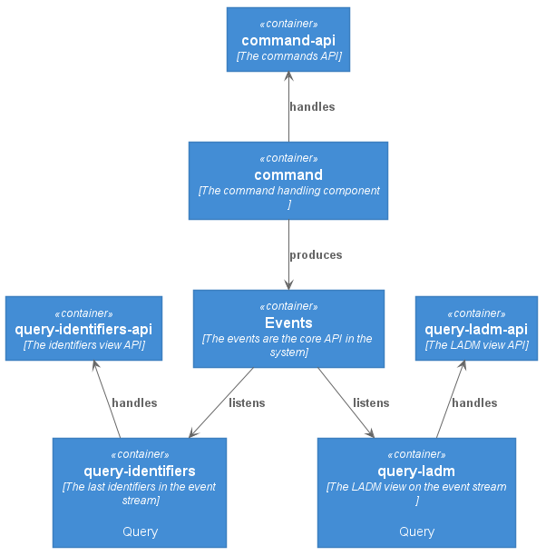

# Land Administration in an EventSourced way

Based on [this article](https://medium.com/@marc.van.andel/paradigm-shift-from-single-model-to-commands-events-and-queries-ee68a97de9aa) (written by me) I would like to develop and proof the Commands, Events and Queries involved in the (ISO) standardized [Land Administration Domain Model](http://www.gdmc.nl/publications/2011/Land_Administration_Domain_Model.pdf) (LADM).
This model is basically a Single Model close to a Query Model in the article.
To build an application with Command, Events and Queries we need to apply CQRS, Command Query Responsibility Segregation, and Event Sourcing.
These patterns are promoted in the Domain Driven Design community.

This repo is an example on how a Land Administration system could be set up in a Event Sourced way.
It shows how these patterns can be applied to a Land Administration system as a showcase for a (Dutch) Core Administration (Basisregistratie).
This is a very (!) simplified system of how [Kadaster](www.kadaster.nl) is using [AxonFramework](http://www.axonframework.org) to apply CQRS and Event Sourcing to their internal Land Administration system.

## Background info

- Land Administration Domain Model (ISO19152) - submitted by [FIG](http://www.fig.net)
  - [TU Delft Wiki](https://wiki.tudelft.nl/bin/view/Research/ISO19152/WebHome)
  - [FIG article of the month 2019 Dec](http://www.fig.net/resources/monthly_articles/2019/Lemmen_etal_December_2019.asp)
  - [LADM UML](https://github.com/ISO-TC211/HMMG) (@ Github)

- [AxonFramework](http://www.axonframework.org) (including AxonServer)
  - [github.com/AxonFramework](https://github.com/AxonFramework/AxonFramework)
  - [github.com/AxonServer](https://github.com/AxonIQ/axon-server-se)

## Architecture & Structure

To guarantee (and enforce) the segregation of Commands, Events and Queries each API is put into a separate module. 
There's only one Command side and multiple Query sides.
Each Query component has its own (separate) API module.
Events are the CoreAPI of the system and there are some other value types and utils in this module as well.



## Development

### Running

1. Start AxonServer:
    ```
   docker run --rm -d --name my-axon-server -p 8024:8024 -p 8124:8124 --hostname axonserver -e AXONSERVER_HOSTNAME=axonserver axoniq/axonserver
    ```
1. Start Core: `:core/nl.kadaster.land_administration.LandAdministration.main()`

### Shutdown

1. Stop AxonServer:
```
docker stop my-axon-server
```

### Structure

> UNDER CONSTRUCTION

#### module: view-ownership

A view for getting the current owner of a parcel. This can be implemented lazy load, i.e.,  when requesting a given parcel all events for that parcel are replayed.

### module: view-ownership-history

A view for obtaining the ownership with all its history. This can not be implemented lazy load, i.e., when requesting the ownsership of a given subject, all associated parcels are unknown.

# Kadaster Open Source & Event Sourced

- Engels
- Event Sourced
- LADM (ISO 19152)
- DSLs?
- Technology stack:
  - JVM?
    - Java
    - Scala
    - Clojure
  - Kafka?
- Hoe krijgen we dit als business pitch voor elkaar?
  - Kadaster International
  - Bestuur
  - MBP: partner (niet alleen geo!), platform (niet alleen geo!)
  