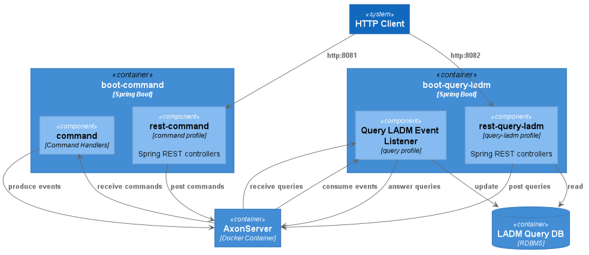

# Land Administration in an EventSourced way

Based on [this article](https://medium.com/@marc.van.andel/paradigm-shift-from-single-model-to-commands-events-and-queries-ee68a97de9aa) (written by me) I would like to develop and proof the Commands, Events and Queries involved in the (ISO) standardized [Land Administration Domain Model](http://www.gdmc.nl/publications/2011/Land_Administration_Domain_Model.pdf) (LADM).
This model is basically a Single Model close to a Query Model in the article.
To build an application with Command, Events and Queries we need to apply CQRS, Command Query Responsibility Segregation, and Event Sourcing.
These patterns are promoted in the Domain Driven Design community.

This repo is an example on how a Land Administration system could be set up in a Event Sourced way.
It shows how these patterns can be applied to a Land Administration system as a showcase for a (Dutch) Core Administration (Basisregistratie).
This is a very (!) simplified system of how [Kadaster](www.kadaster.nl) is using [AxonFramework](http://www.axonframework.org) to apply CQRS and Event Sourcing to their internal Land Administration system.

## Background info

- Land Administration Domain Model (ISO 19152) - submitted by [FIG](http://www.fig.net)
  - [TU Delft Wiki](https://wiki.tudelft.nl/bin/view/Research/ISO19152/WebHome)
  - [FIG article of the month 2019 Dec](http://www.fig.net/resources/monthly_articles/2019/Lemmen_etal_December_2019.asp)
  - [LADM UML](https://github.com/ISO-TC211/HMMG) (@ Github)

- [AxonFramework](http://www.axonframework.org) (including AxonServer)
  - [github.com/AxonFramework](https://github.com/AxonFramework/AxonFramework)
  - [github.com/AxonServer](https://github.com/AxonIQ/axon-server-se)

## Architecture

### Structure

To guarantee (and enforce) the segregation of Commands, Events and Queries each API is put into a separate module. 
There's only one Command side and multiple Query sides.
Each Query component has its own (separate) API module.
Events are the CoreAPI of the system and there are some other value types and utils in this module as well.


* module `command-api` -> All available Commands
* module `command` -> Command Handlers
* module `events` -> Core API of the system including some value types and utils
* module `query-ladm-api` -> View LADM: The Query API
* module `query-ladm` -> View LADM: The EventListener as well as the Query Handler
* module `query-identifiers-api` -> View Identifiers: The Query API
* module `query-identifiers` -> View Identifiers: The EventListener as well as the Query Handler

In runtime there are these containers:





### TechStack

- Java based with more Functional Programming options: [Kotlin](https://kotlinlang.org/)
- Building and dependency management: [Gradle](https://gradle.org/)
- For CQRS and Event Sourcing with Java: [AxonFramework](https://axoniq.io/product-overview/axon-framework)
- Running with Spring Boot: [Spring Boot](https://spring.io/projects/spring-boot) (and the whole [Spring Framework Stack](https://spring.io/))


## Development

### Local Development Set Up

You'll the Java Virtual Machine to run and develop locally. 
An easy way to install and control several versions of Development kits is [SDKman](https://sdkman.io/)
First [install](https://sdkman.io/install) this and next install the Java SDK:

```
sdk install java 13.0.2.hs-adpt
```

No need to install Gradle (because of the Gradle Wrapper) but if you would like to install it, look at [Scoop](https://scoop.sh/): `scoop install gradle`


### Build

The build uses [Gradle](https://gradle.org/) with the [Gradle Wrapper](https://docs.gradle.org/current/userguide/gradle_wrapper.html)

```
./gradlew build
```

### Running

1. Start AxonServer: `./axon-server.sh start` (or `restart`)
1. Start Core: `:boot/nl.kadaster.land_administration.LandAdministration.main()`
   1. Profile `command` for the Command instances and REST services (incl. Identifiers Query instances and REST services)
   1. Profile `query-ladm` for the LADM Query instances and REST services

### Shutdown

1. Stop AxonServer: `./axon-server.sh stop`
